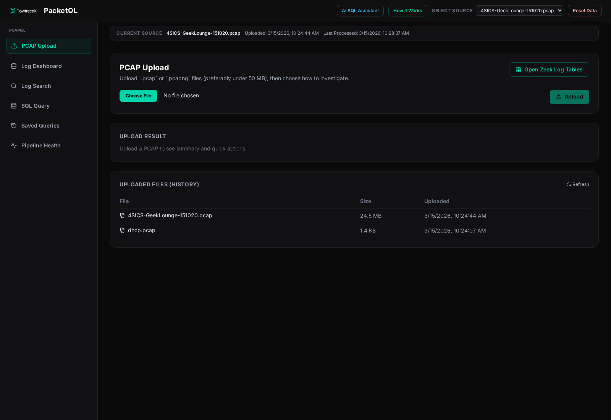
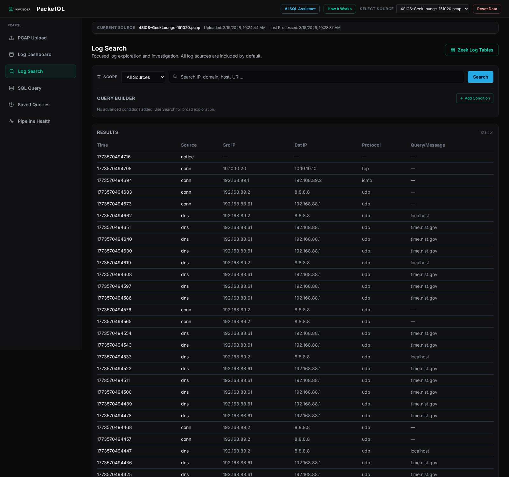
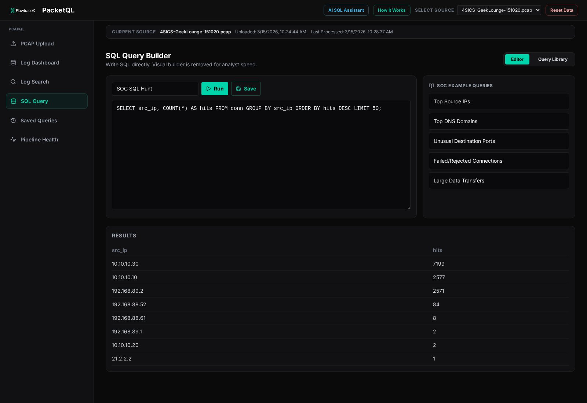

# PacketQL

[](https://hub.docker.com/r/jobish/packetql)
[](https://packetql.flowtracex.com)
[](https://github.com/flowtracex/PacketQL)

PacketQL is an open-source packet investigation platform that turns PCAP files into SQL-queryable security data.


Status: **Public Beta**

Recommended deployment: **single Docker container**

## Why PacketQL

- Upload `.pcap` and `.pcapng` files from a browser
- Parse traffic with Zeek in the background
- Normalize logs into structured protocol tables like `conn`, `dns`, `http`, `ssl`, and more
- Store data in Parquet and query it with DuckDB
- Investigate with a SOC-focused UI for dashboarding, log search, and SQL

## Recommended Deployment

Use the Docker image.

1. `docker pull`
2. mount a host directory to `/data`
3. open the UI and upload a PCAP

PacketQL bundles the full pipeline in one container, so you do not need to set up Zeek, Kafka, plugins, the API, or the frontend separately.

## Architecture

Pipeline:

```text
PCAP -> Zeek -> Kafka -> Go pipeline -> Parquet -> DuckDB -> API/UI
```

More detail: [docs/ARCHITECTURE.md](docs/ARCHITECTURE.md)

## Product Screenshots

### PCAP Upload

Upload `.pcap` and `.pcapng` files, then move directly into investigation workflows.



### Log Search

Search normalized protocol data and pivot through investigation results.

<a href="docs/screenshots/log-search.png">
  
</a>

### SQL Query

Run SQL against structured protocol tables and inspect results in the same workflow.



## Quick Start With Docker Hub

```bash
docker pull jobish/packetql:beta

mkdir -p /opt/packetql-data

docker run -d \
  --name packetql \
  -p 3000:3000 \
  -v /opt/packetql-data:/data \
  -e APP_MODE=demo \
  jobish/packetql:beta
```

Open: `http://localhost:3000`

If port `3000` is already used:

```bash
docker run -d \
  --name packetql \
  -p 8088:3000 \
  -v /opt/packetql-data:/data \
  -e APP_MODE=demo \
  jobish/packetql:beta
```

Open: `http://localhost:8088`

## Quick Start From Source

Use this only if you are building the Docker image yourself.

```bash
git clone https://github.com/flowtracex/PacketQL.git
cd PacketQL
./docker/build-image.sh

docker run -d \
  --name packetql \
  -p 3000:3000 \
  -v /opt/packetql-data:/data \
  packetql:single-optimized
```

Important:

- Building the image locally currently expects a working Zeek runtime on the build host
- End users who pull from Docker Hub do not need that local Zeek setup

More details: [docker/README.md](docker/README.md)

## What The Container Includes

- Zeek runtime
- Kafka in KRaft mode
- Go normalization and enrichment pipeline
- Parquet output
- DuckDB-backed querying
- Django API served by Gunicorn
- React frontend served by nginx

## Runtime Data

Mount a host directory to `/data`.

This external volume stores runtime state such as:

- uploaded PCAPs
- parquet outputs
- source metadata
- Kafka data used by the bundled container

This keeps your investigation data outside the container image.

## PCAP Guidance

- Supported: `.pcap`, `.pcapng`
- Recommended for smooth analyst workflow: **below 50 MB**
- Larger PCAPs can work, but tuning and throughput optimization are still improving during beta

## Manual Deployment

Manual service-by-service deployment is possible, but it is **not** the recommended first-time setup.

If you deploy manually, you are responsible for configuring and operating:

- Zeek
- Kafka
- plugin/runtime wiring
- API service
- frontend service
- runtime paths and persistence

For GitHub visitors, we recommend documenting manual deployment as an advanced path for contributors, not the default install method.

## Repository Layout

- `ndr-frontend/gui` - React analyst UI
- `ndr-api/flowtracex_api` - Django API and PCAP ingest endpoints
- `ndr-enrich` - Go pipeline for normalization, enrichment, and Parquet writing
- `ndr-config` - schemas, datasets, and configuration
- `docker` - single-container Docker build and runtime assets
- `docs` - launch notes and architecture

## Open Source Positioning

Recommended wording for GitHub and Docker Hub:

- `Public Beta`
- `Single-container SOC PCAP investigation platform`
- `Fast setup for labs, demos, and internal evaluation`

Suggested short tagline:

- `Turn PCAP files into SQL-ready security investigations in minutes`

Avoid claiming:

- `production ready`
- `internet hardened`
- `large-scale throughput optimized`

until you complete full release hardening and soak testing.

## Known Limitations

- Best experience today is the bundled Docker deployment
- Recommended PCAP size is below `50 MB`
- Production hardening is still evolving
- Large-PCAP throughput tuning is still being improved

## Contributing

PRs and issues are welcome.

If you want to contribute to the internals, the manual stack and source layout are documented in the subproject READMEs.

## Additional Docs

- [docs/ARCHITECTURE.md](docs/ARCHITECTURE.md)
- [docs/PUBLISHING.md](docs/PUBLISHING.md)
- [docker/README.md](docker/README.md)
- [docs/LAUNCH_CHECKLIST.md](docs/LAUNCH_CHECKLIST.md)

## Disclaimer

PacketQL is provided as-is for defensive security operations, research, and education.
